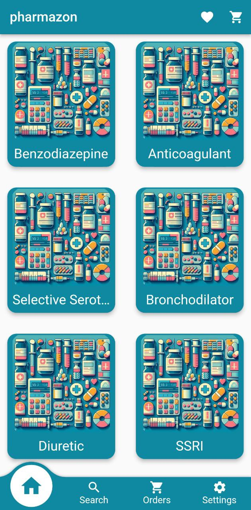

# pharmazon - Flutter Android App

Pharmazon is a Flutter project designed to create a mobile application for Android devices. The app empowers pharmacists to place orders, track their status, and manage their favorite medicines.

## Features

- **User Authentication:**
  - Pharmacists can register and log in to the mobile app using their mobile number.

- **Medicine Ordering:**
  - Pharmacists can browse medicines, search for specific items, and place orders with desired quantities.

- **Order Management:**
  - Pharmacists can view their order history and track the status of current orders.

- **Favorites List:**
  - Pharmacists can maintain a list of favorite medicines for quick access.

- **Language Preferences:**
  - Users can switch between Arabic and English languages with localization handled.

- **Reports:**
  - Users can check the payments that had been done in a certain month.  

- **Code information:**
  - The code is super clean and with using MVVM architecture and BLOC state mangement.  

## Additional

There is a web admin app to handle the orders and its states.

## Screenshots

## License

This project is licensed under the [MIT License](LICENSE).
